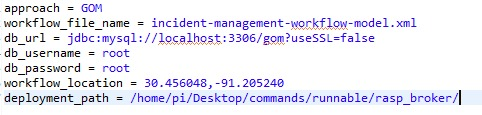


**Composition and Management of Distributed Applications in the Cloud and Edge Computing Environment**

**Instructions on how to run the IoT-Centric-Workflows-Orchestration system**

**Step 1: Install Eclipse**

If you haven't already, download and install Eclipse from the official website (<https://www.eclipse.org/downloads/>). Choose the version that suits your operating system.

**Step 2: Import Java project**

Launch Eclipse and import the Java project by following these steps:

1. Click on "File" in the menu bar.
1. Select "Import" and then `Existing Projects into Workspace` browse to directory and Finish.

**Step 3:  Importing database:**

First, we need to create the database with name `gom`, then import the database dump file named as `gom.sql`

Add the SQL dump file to your database and update the MySQL connection string according to your credentials by updating them in code. 

**Step 4:  Configuring options:**

The following options can be configured in the `workflow-coordinator/config/config.properties` file

1. Approach (GOM or LOM)

2. Workflow file 

3. MySQL credentials

4. Workflow location

5. Deployment path

**step 5: Sample Commands to run java Jar files on devices and Coordinator PC for all components:**

Deploy from the following JARs depending on the scenario to be executed on the respective devices:

1. workflow-coordinator.jar

	

2. peer-node-gom.jar

	sudo java -jar peer-node-gom.jar "tcp://[IP of the PC running workflow-coordinator]:1883" "tcp://[IP of the current device]:1883" "tcp://[IP of the other peer-node device]:1883" "tcp://[IP of the end-device]:1883" "tcp://[IP of the other end-device]:1883" "45"

3. peer-node-lom.jar

	sudo java -jar peer-node-lom.jar "tcp://[IP of the PC running workflow-coordinator]:1883" "tcp://[IP of the current device]:1883" "tcp://[IP of the other peer-node device]:1883" "tcp://[IP of the end-device]:1883" "tcp://[IP of the other end-device]:1883" "45"

4. end-device.jar

	sudo java -jar end-device.jar "tcp://[IP of the peer-node device]:1883" "tcp://[IP of the current device]:1883" "tcp://[IP of the other end-device]:1883" "45"

**Commands Execution on Devices:**

After running the above commands on their respective devices, Devices start interacting with each other on Coordinator.

